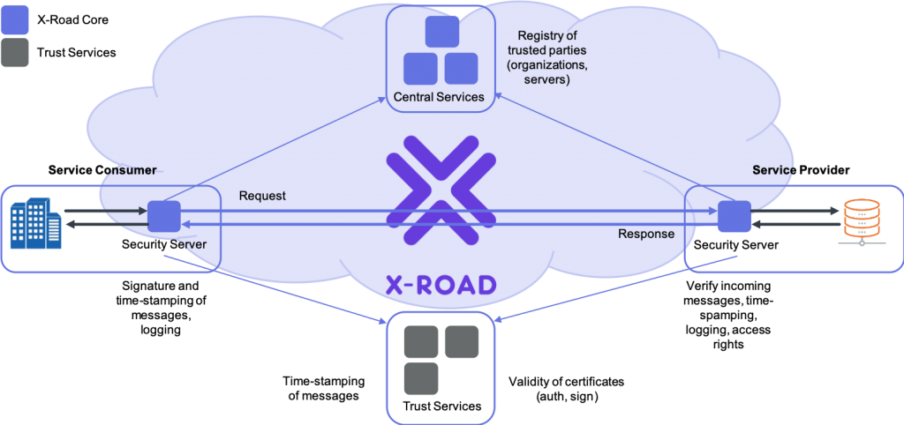

## Gestión de Servicios

### 1. Conceptos ###





Conceptos generales de la plataforma nacional de interoperabildad.

**Proveedor de Servicio:** Un sistema de información conectado a la plataforma a través de un cliente/pasarela de seguridad que ofrece datos a clientes autorizados.

**Consumidor de Servicio:** Un sistema de información conectado a la plataforma a través de un cliente/pasarela de seguridad que consume datos como cliente autorizado.

**Cliente:** Un registro creado en la pasarela de seguridad que permite gesitonar autoizaciones para que un sistema de información conectado a la plataforma funcione como consumidor o proveedor de servicio.

**Miembro:**  Una organización o entidad afiliada, cada miembro controla uno o más clientes en la plataforma, que pueden operar como proveedor y / o consumidor de servicios.

**Servicios de Confianza:** Conjunto de servicios de gestion de certificados, firmas y sellos digitales que hacen posible el funcionamiento de la plataforma. Estos incluyen una Autoridad de Certificación, validación (OCSP) y Sellos de tiempo (TSA) y son administrados por Presidencia.

**Catálogo Central:** Indice central de miembros y sus clientes, disponible para todos los miembros activos de la red. El catálogo central también es reponsable de distibuir cambios en los servicios de confianza a toda la red.  

**Tenoli:** Es una instalación de X-Road, es la plataforma nacional de interoperabildad. Es un canal de comunicación estandarizado que proporciona una forma estándar de transferir información entre organizaciones y faciita la construcción servicios públicos integrados y seguros.


## 2. Modelo de Seguridad de Mensajes ##

1. Sistema Consumidor ---- TUNEL (M)TLS --> Pasarela de Seguridad Consumidor

2. Pasarela de Seguridad Consumidor  ---- TLS/SERVICIOS DE CONFIANZA --> Pasarela de Seguridad Proveedor

3. Pasarela de Seguridad Proveedor ---- TUNEL (M)TLS --> Sistema Proveedor 


## 3. Autorización de Consumo de Servicio ###

*Comunicación entre sistemas SI1-SS1 hacia SS2-SI2**

Es responsabilidad del administrador de la **Pasarela de Seguridad Consumidor** solicitar acceso/autorización al servicio publicado en la **Pasarela de Seguridad Proveedor**. La comunicación no sera posible hasta que el administrador proveedor agregue en su pasarela una regla para que el servicio de consulta pueda consumir los datos. Si no existe esa regla, el sistema responderá con un error similar al siguiente:

```
"type":"Server.ServerProxy.AccessDenied"","message":"Request is not allowed: SERVICE: ...
```

## 2. Servicio de Información ##
* SI1: Sistema de información que consume datos  
* SS1: Pasarela de seguridad con sub-sistema de consumo "sv-test/GOB/1001/consulta"
* SS2: Pasarela de seguridad con sub-sistema que entrega datos
* SI2: Sistema de información que produce datos. "sv-test/GOB/1001/api-pruebas/consulta-pruebas"

El tunel TLS entre SS1 y SS2  utiliza los certificados frimados por la autoridad cetificadora de Presidencia. 

**Comunicación SI1 ---> SS1**

Para consumir un servicio desde la red interna, primero debe crearse el sub-sistema consumidor (vacío). Desde la ventana de configuración del sistema, en la pestaña "Servidores Internos" se debe definir el modo de conexión interno, por defecto es HTTPS con autenticación; por lo que es necesario crear y agregar un certificado interno usando los siguientes pasos:  
  
```
openssl req -x509 -nodes -sha256 -days 365 -newkey rsa:2048 -keyout consumidor-api.key -out consumidor-api.crt -subj "/C=SV/O=Gobierno de El Salvador/O=PRUEBAS/OU=CERTIFICADO AUTOFRIMADO/CN= Consumidor - API de Integración de datos"
```

Asegurase de subir e archivo consumidor-api.crt a la lista de certificados TLS internos y luego pruebe el servicio usando los certificados que acaba de crear desde su sistema de información que consume datos o usando la siguiente linea de comandos:
```
curl -k -E consumidor-api.crt --key consumidor-api.key -X GET -H 'X-Road-Client: sv-test/GOB/1001/consulta' -i 'https://localhost/r1/sv-test/GOB/1001/api-pruebas/consulta-pruebas'
``` 

**Comunicación SS2 ---> SI2**
Desde la ventana de configuración del sistema, en la pestaña "Servidores Internos" se debe definir el modo de conexión interno, por defecto es HTTPS con autenticación; por lo que es necesario agregar el certificado a la lista de certificados TLS internos.  El certificado debe ser el mismo que utiliza el servidor donde reside el sistema de información interno (SS2). Por ejemplo para un servidor Nginx se debe subir el certificado de la propiedad 'ssl_certificate':

```
  ssl_certificate /etc/ssl/certs/api-autofirmado.crt;
 ```
      
**SI2 con MTLS**

Si el sistema de información requiere un certificado de clietne autorizado, el servidor de seguridad SS2 enviará automaticamente su certificado interno. Si el certificado no esta autorizado se generara este error:
```
{"type":"Server.ServerProxy.SslAuthenticationFailed","message":"Server certificate is not trusted",
```

Debe instalarse un nuevo certificado, que este autorizado, en la pasarela SS2. Seleccione Menu Principal, Parámetros del Sistema, Certificado TLS Interno, generar petición de certificado. Ingrese el sujeto que desea usar en su nuevo certificado: CN=servicios.local,OU=Ministerio xxx,O=Gobierno de El Salvador,C=SV. 

La petición/soliciud de certificado debe ser firmada por la Autoridad Certificadora que esta usando el servidor web, como se explica en la seccion de [firmar solicitud de pasarela de seguridad](crear_API_con_MTLS.md)


